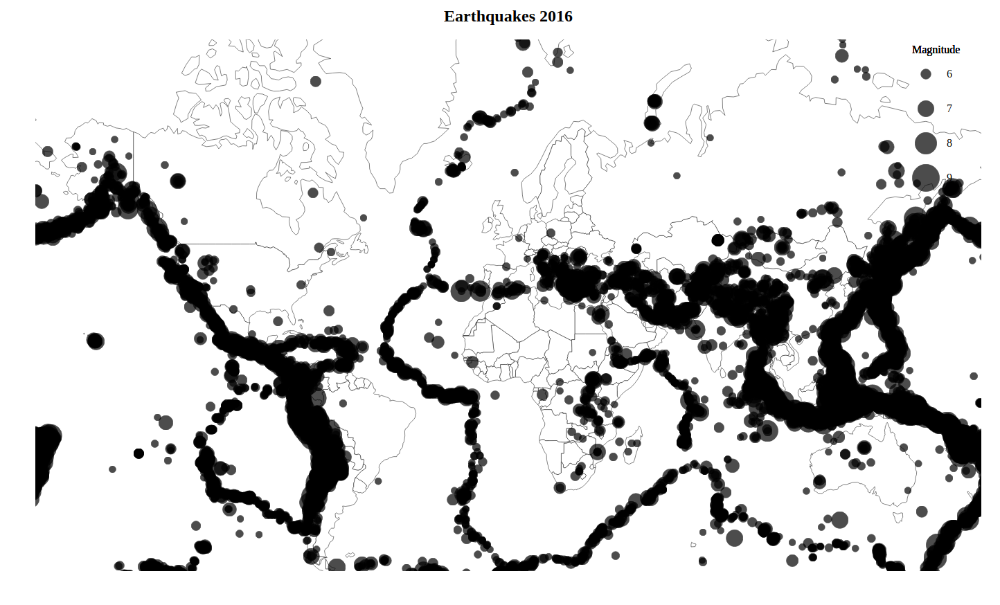
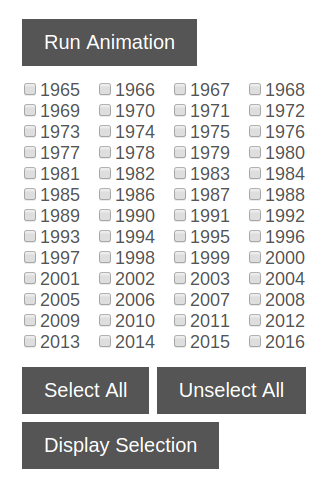
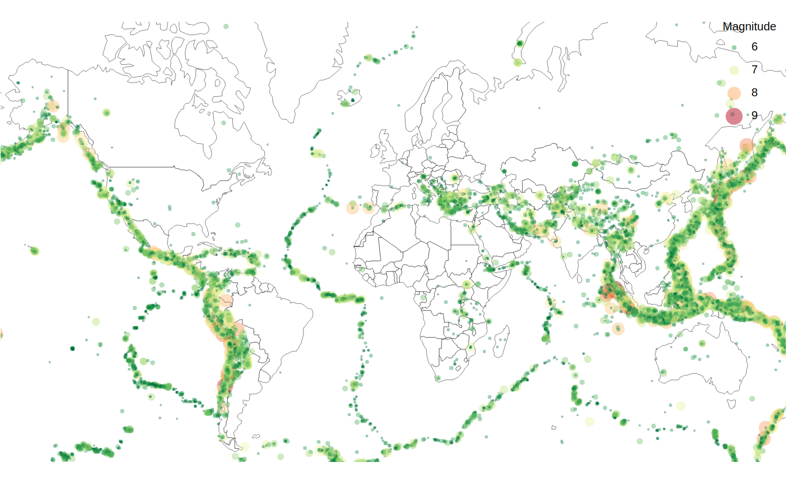

# Make Effective Data Visualizations: Earthquakes Around The World

## Summary

In this project I created an animated visualization of all the significant 
earthquakes that happened between 1956 and 2016. For this visualization I used 
the JavaScript library [D3.js](https://d3js.org/). The animation shows the 
earthquakes for each year separately but the included buttons and checkboxes
allow to look at any selection the user desires.

The data used for this project was collected by the [National Earthquake 
Information Center](https://earthquake.usgs.gov/contactus/golden/neic.php) and 
is publicly available on their website. I used a preprocessed data set from 
[Kaggle](https://www.kaggle.com/usgs/earthquake-database) which only contains 
earthquakes with a magnitude higher than 5.5 on the Richter scale. Before using 
the dataset, I preprocessed  with a simple Python script.

Looking at the animation and single years gives a good overview about the
frequency of earthquakes within the different magnitude categories. Eathquakes
with a magnitude between 5 and 6 can already cause major damage to badly 
constructed buildings. More than 1000 of those occur every year but of course
not all of them are recorded by the NEIC as a large portion of them takes place
deep underground. Earthquakes with a magnitude between 6 and 7 on the Richter 
scale are already considered as strong. They can damage even well-built 
structures and happen around a 100 times each year. The category of "major"
earthquakes (7.0-7.9) already affects most buildings that were designed to
withstand strong shocks and can be observed at least 10 times across the globe.
All earthquakes stronger than 8 on the Richter scale are described as "great",
can lead to total destruction and luckily only happen every few years. In this
category fall such earthquakes as the one off the West coast of Nothern Sumatra

Key messages from the plot...

Distribution along tectonic plate boundaries

Types of boundaries visible as strong earthquakes mainly happen in specific places

Evolution over time?

Data preparation with short python script...

## Design

The final visualization I ended up with is a bubble chart on top of a mercator
projection of the globe. The magnitude is encoded in the bubble size as well as
the color of the bubbles. As the Richter scale is a logarithmic scale, meaning
that a magnitude increase of 1 denotes an earthquake that is 10 times stronger, 
I think that using two visual encodings simultaneously is a reasonable measure
to reinforce the differences. Including color also allows to gain better
information when all earthquakes are displayed simultaneously and the data points
overlie with each other.

For the bubble size also logarithmic scale

red for severe earthquakes and green for weaker ones as most people associate
danger with the color red

chart type, visual encodings, and layout

## Feedback

After creating an initial working prototype I discussed the 
visualization with friends and co-workers. Many fine iterations happened based 
on their thoughts and I want to mention some of them here in this section.

### First Iteration

Starting from a simple animation that plays upon page load and displays all the 
earthquakes accumulated over the years I started working on a control panel to 
add some interactivity to the page. 

My intent was to let the user choose if he wants to look at the data from 
individual years, a custom selection or just observe a time lapse over the whole
timespan. The picture below shows the final button and checkbox configuration I
ended up with.

Upon page load, all the data is displayed. By pressing the "Run Animation" button
the animation starts with an empty world map in 1965 and adds the earthquakes 
for all the following years. Selecting certain years through the checkboxes 
followd by pressing the "Display Selection" allows to investigate only certain
years. The "Select All" button checks all the boxes while the "Unselect All"
resets the panel.

### Second Iteration

Next in line was improving the representation of the data on the world map. So 
far I have only used

Furthermore, I changed the animation so that it only displays the data for each
year separately and does not accumulate and overlay it over time.

In my opinion, this measures improved the perception of magnitude differences
significantly and left the map far less crowded.

- hue vs. size and change of animation from overlaying to displaying only a single year

### Third Iteration

One of the feedbacks I received was to use tooltips to display additional
information in my visualization.

- display magnitude and additional information upon hover

## Resources

* D3.js
* NEIC
* chromatic color scale

## Data

columns:

'Date', 'Time', 'Latitude', 'Longitude', 'Type', 'Depth', 'Depth Error',
'Depth Seismic Stations', 'Magnitude', 'Magnitude Type',
'Magnitude Error', 'Magnitude Seismic Stations', 'Azimuthal Gap',
'Horizontal Distance', 'Horizontal Error', 'Root Mean Square', 'ID',
'Source', 'Location Source', 'Magnitude Source', 'Status'

magnitude range:

5.5 -> 9.1

magnitude categories:

http://www.geo.mtu.edu/UPSeis/magnitude.html

depth range:

-1.1 -> 700

depth categories:

https://earthquake.usgs.gov/learn/topics/determining_depth.php

type:

'Earthquake' 'Nuclear Explosion' 'Explosion' 'Rock Burst'

