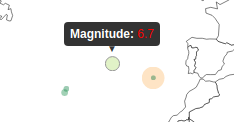

# Make Effective Data Visualizations: Earthquakes Around The World

## Summary

In this project I created an animated visualization of all the significant 
earthquakes that happened between 1956 and 2016. For this visualization I used 
the JavaScript library [D3.js](https://d3js.org/). The animation shows the 
earthquakes for each year separately but the included buttons and checkboxes
allow to look at any selection the user wants to.

The data used for this project was collected by the [National Earthquake 
Information Center](https://earthquake.usgs.gov/contactus/golden/neic.php) and 
is publicly available on their website. I used a preprocessed data set from 
[Kaggle](https://www.kaggle.com/usgs/earthquake-database) which only contains 
earthquakes with a magnitude higher than 5.5 on the Richter scale. Before using 
the dataset, I preprocessed it with a simple Python script.

Looking at the animation and single years gives a good overview about the
frequency of earthquakes within the different magnitude categories. Eathquakes
with a magnitude between 5 and 6 can already cause major damage to badly 
constructed buildings. More than 1000 of those occur every year but of course
not all of them are recorded by the NEIC as a large portion of them takes place
deep underground. Earthquakes with a magnitude between 6 and 7 on the Richter 
scale are already considered as strong. They can damage even well-built 
structures and happen around a 100 times each year. The category of "major"
earthquakes (7.0-7.9) already affects most buildings that were designed to
withstand strong shocks and can be observed at least 10 times across the globe.
All earthquakes stronger than 8 on the Richter scale are described as "great",
can lead to total destruction and luckily only happen every few years. In this
category fall such earthquakes as the one off the West coast of Nothern Sumatra
(9.1) that lead to the Tsunami in 2004 or or the on in Japan in 2011 (9.1) that
caused the meltdowns in the Fukushima nuclear plant.

Of course I knew beforehand that the boundaries of the tectonic plates are
the most seismically active zones but I was nevertheless surpised on how 
perfectly the data points from the last 50 years align with these boundaries. 
Based on the earthquake magnitudes at these locations one can also clearly
identify the different types of tectonic boundaries. For example the extremely
active zone along the western coast of South America can be explained by the 
converging boundary formed by the Nazca and South American plate. There the 
plates slide towards each other and form a subduction zone accompanied by
very strong earthquakes. In the east on the other hand, the South American and 
the African plate form a diverging boundary where they move away from each 
other. These zones are far less active which is confirmed by the many small 
green bubbles.

## Design

The final visualization I ended up with is a bubble chart on top of a mercator
projection of the globe. The magnitude is encoded in the bubble size as well as
the color of the bubbles. As the Richter scale is a logarithmic scale, meaning
that a magnitude increase of 1 denotes an earthquake that is 10 times stronger, 
I think that using two visual encodings simultaneously is a reasonable measure
to reinforce the differences. Including color also allows to gain better
information when all earthquakes are displayed simultaneously and the data points
overlie with each other. I used the red for the bubbles of the strongest 
earthquakes as most people associate danger with this color while green is 
perceived as less harmful.

The page is split into two panes. On the left side is a short introduction
as well as the control panel to play around with the visualization. The control
section contains five buttons as well as a checkbox for each year in the data 
set. On the right side is the map with all the data points upon page load as 
well as a legend in the top right corner.

## Feedback

After creating an initial working prototype I discussed the 
visualization with friends and co-workers. Many fine iterations happened based 
on their thoughts and I want to mention some of them here in this section.

### First Improvement

Starting from a simple animation that plays upon page load and displays all the 
earthquakes accumulated over the years I started working on a control panel to 
add some interactivity to the page. 

My intent was to let the user choose if he wants to look at the data from 
individual years, a custom selection or just observe a time lapse over the whole
timespan. The picture below shows the final button and checkbox configuration I
ended up with.

Upon page load, all the data is displayed. By pressing the "Run Animation" button
the animation starts with an empty world map in 1965 and adds the earthquakes 
for all the following years. Selecting certain years through the checkboxes 
followd by pressing the "Display Selection" allows to investigate only certain
years. The "Select All" button checks all the boxes while the "Unselect All"
resets the panel.

### Second Improvement

Next in line was improving the representation of the data on the world map. 
People told me that it was hard to distinguish between individual data points
and that map looked very crowded. 

So far I have only used the size of the bubbles to display the magnitude. I 
played around with various color scales from the [d3-scale-chromatic]
(https://github.com/d3/d3-scale-chromatic) package and ended up with a 
diverging color scale that changes from green over yellow to red. I think this
choice corresponds well with the common perception that green is considered as
safe while red means danger (similar to a street light). I also decreased the
minimum radius of the bubbles to reinforce the difference in size.

Furthermore, I changed the animation so that it only displays the data for each
year separately and does not accumulate and overlay it over time. In my opinion, 
this measures improved the perception of magnitude differences significantly and 
left the map far less crowded.

### Third Improvement

One of the feedbacks I received was to use tooltips to display the exact 
magnitude of a bubble when the cursor hoovers over it. To achieve this used the
help of the [d3-tip]() package. By calling a `tip()` object on the svg map, it
allows to display html upon a 'mouseover' event. I think this addition makes
the visualization more informativ as well feeling more interactive.

## Resources

* D3.js: [https://d3js.org/](https://d3js.org/)
* NEIC: [https://earthquake.usgs.gov/contactus/golden/neic.php](https://earthquake.usgs.gov/contactus/golden/neic.php)
* d3-scale-chromatic: [https://github.com/d3/d3-scale-chromatic](https://github.com/d3/d3-scale-chromatic)
* d3-tip: [https://github.com/Caged/d3-tip](https://github.com/Caged/d3-tip)
